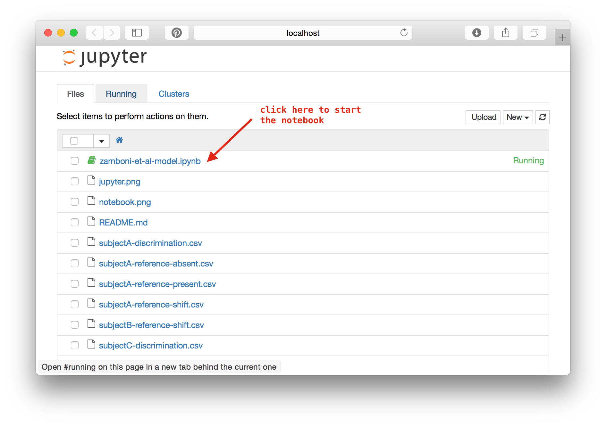
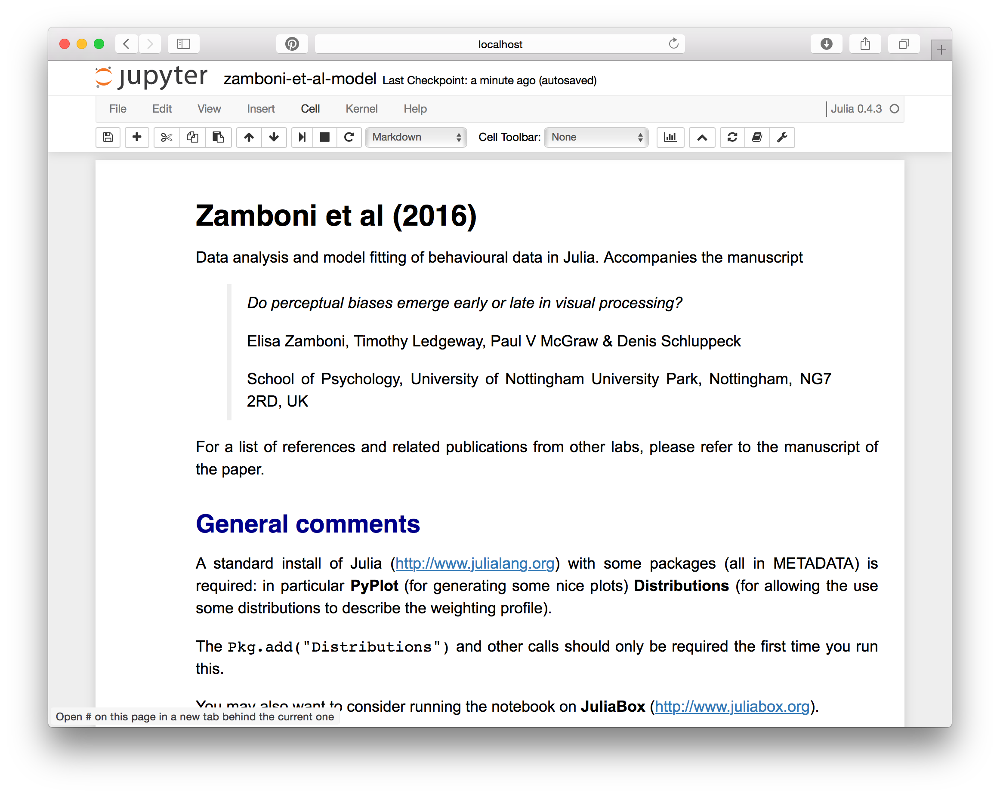

# Zamboni-2016

## Overview

Data and analysis code for Zamboni et al (2016) manuscript.

> *Do perceptual biases emerge early or late in visual processing?*
>
> Elisa Zamboni, Timothy Ledgeway, Paul V McGraw & Denis Schluppeck
>
> School of Psychology, University of Nottingham
> University Park, Nottingham, NG7 2RD, UK

## File description


Data files are provided as comma-separated files. The conventions for the data files included with this code are:

### Discrimination data

    subject[ID]-discrimination.csv

Each row contains data obtained at particular stimulus direction (data were pooled across a 5º range of stimulus directions). There are 4 columns:

1. Binned delta: stimulus direction
2. Proportion CW: proportion of "clock-wise" responses
3. SE: standard error of the "Proportion CW" data
4. Coherence (one of 4 levels)

### Estimation data

    subject[ID]-reference-[absent|present|shifted].csv
    subjectA-reference-absent.csv

Each row contains a trial. For present|absent data, there are 3 columns:

1. (true) stimulus direction
2. estimated direction
3. coherence levels:

For the data obtained in the "shifted" condition, there are 4 columns

1. (true) stimulus direction
2. estimated direction
3. shift (-6º, 0º, +6º)
4. coherence levels

## Implementation of the model

If you just want to have a quick look at an example output from running one of the notebooks, you have a look at [a rendered version in HTML](zamboni-et-al-model.html).

To run the model and visualize the data:

1. Install a version of Julia from http://julialang.org/downloads/
2. **either** clone the repository:
  ``git clone https://github.com/schluppeck/zamboni-2016.git``  
3. **or** (if you want to avoid ``git``), download a zip archive of the repository and unpack it. https://github.com/schluppeck/zamboni-2016/archive/master.zip
4. Under Mac OSX, there is a double-clickable application (``/Applications/Julia.app``). Alternatively, you could create an command line alias with ``alias julia='/Applications/Julia-0.4.2.app/Contents/Resources/julia/bin/julia'``

```bash
cd zamboni-2016
julia # to start julia
```

Then, from inside the Julia shell, launch the notebook server:

```julia
# install and update packages
Pkg.add("IJulia")
Pkg.update()
# start using them
using IJulia
notebook()
# this will launch the Jupyter notebook interface in   your web browser
```

Select the notebook in the browser window  


... and start stepping through the code by executing cells in turn (Shift-Return).


